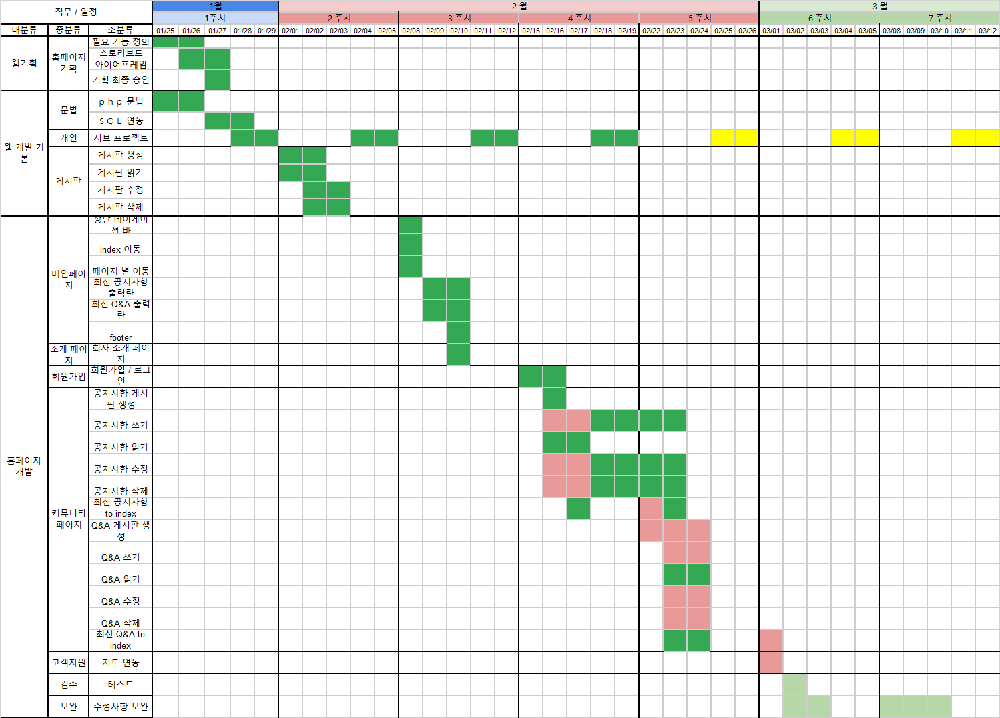

# contenteditable 이용한 create 구현 / a href -> form post 이전

## 타임라인 확인
- 웹기획 : 추가적인 modal, 세션활동 등으로 공수 추가, dropdown의 공수가 낮아 추가함.
- 웹 개발 기본 : 
    - php, MySQL등의 기본 문법 습득 완료
    - JS 의 경우 추가적인 학습 필요
- 홈페이지 개발
    - 메인페이지 : 기능 구현 모두 완료
    - 회원가입, 로그인 : modal 로 처리하는 기능이 추가되면서 공수가 추가됨. 
    - 커뮤니티 페이지(게시판) : 
        - 생성 : contenteditable을 이용한 생성 시도 중 보안이슈는 필터링 함수들을 이용해 해결하고자함
        - 읽기 : 기존 GET 방식의 request를 유지하면서 사용성이 좋은 구조를 만들어보고자 함
        - 수정 , 삭제 : 계정 간( root / guest / member) 권한 설정외에 공수가 적을 것으로 기대
    - 고객지원 : 지도 API 연동 남아 있음
    - 검수 : 매주 수요일에 받고 있으며 6주차 ( 3월 3일엔 마무리 할 예정)

## 달성 목록
- contenteditable 을 attr을 이용한 create 구현 중 
- 게시판의 control-flag 라는 POST 의 헤더를 통해 게시판 페이지 변환을 시도중 

##  보완사항
- board
    - contenteditable 사용 시 mysqli_real_escape_string / htmlspecialchars 을 태그 수정을 통한 보안 이슈를 최소화 해야함
    - board 에서  create 구현 필요 ( 회원 처리 선행 필요)
    - board detail의 modify, delete 기능 구현
    - modify의 경우 페이지 내에서 
    - delete의 경우 modal을 통해
    - read_article에서 title, author 등 유효성 검사해서 없으면 출력하지 않게 구현 - 2 
- author
    - root, guest , member 로 분류해야함
    - 기본적으로 guest로 db 접속
    - root 로그인 시 전체 회원 정보
    - member 로그인 시 본인 회원정보
    - root는 전체 회원정보 조회,수정,삭제 가능
    - member 회원정보 create, modify, delete는 index.php 에서 modal로  
    - delete 시 비밀번호 검사
    - ~~정보를 받을때 format 사용 검토 ( 정규화 )~~
- page 
    - contact 페이지 google api / kakao map / naver api 연동 필요 시간이 허락하는 한 전부
    - 회사 소개 페이지의 인터렉티브 요소 추가

## 뛰놀자 WA 인증 관련 
 - Web  Accessibility (웹 접근성) 인증 관련 이미지 alt 텍스트 추가 작업 20여건 진행
 - 호텔 소개의 메인 브로셔의 관련된 업무 진행